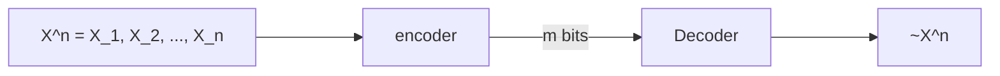

#  LEC 1 INTRODUCTION

## Application

1. Data Compression
2. Storage: Redundancy and Efficiency
3. BIG DATA: Distributed computation, distributed storage
4. Information and AI
5. Security


# LEC 2 ENTROPY

## Entropy

### Brief history

- Second law of thermodynamics: one way only
- Boltzmann Equation
- Information Entropy


### Definition

- X be a discrete random variable with alphabet $\mathcal{X}$ and probability mass function $p(x)=Pr(X=x) x\in \mathcal{X}$
- For *convenience*, the entropy is defined as 

$$
H(X) = -\sum_{x\in \mathcal{X}}p(x)log\space p(x)
$$

- $\lim x\rightarrow 0, xlogx\rightarrow 0$, sometimes we have P(x) = 0, entropy is 0
- $H(X)$ only depends on p.m. f.
- $H(X)\ge0$
- When X is uniform over X, then $H(X)=log|\mathcal{X}|$
- $H_b(X) = log_baH_a(X)$, when $b=e$, the unit is *nats*, when $b=2$, unit is bits.


### Example

- Binary entropy function $H(p)$, let

$$
X = 
\left\{
\begin{aligned}
p \\
1-p
\end{aligned}
\right.\\
H(X) = -plogp - (1-p)log(1-p)
$$

​		This function is symmetric and concave.

- $H(X) = E_plog{1\over P(x)}$


### MAX value

- For a discrete variable $X$ on $\mathcal{X}$, $0 \le H(X) \le log|\mathcal{X}|$

- Proof:

- 1.  For every element of entropy, $-p(x)log(p(x)) \ge 0$, left side is right
	2.  For right side, we first need to prove a property of concave function.

	$\text{Lemma: Suppose } \{p_1,p_2, \dots, p_k\} \text{is a probability distribution, function }f(x) \\ \text{ is concave in the range }[a, b]\text{, we have }\{x_1, x_2, \dots, x_k\} \in [a,b], \text{prove that, }\\ \sum_ip_if(x_i) \le f(\sum_i p_ix_i)$

	Proof: we are going to prove it by mathematical deduction

	$\text{suppose:} k=1, f(x_1) = f(x_1)\\\text{suppose } k=n \text{ is true, } p_1f(x_1) + \dots + p_kf(x_k) \le f(\sum_i^kp_ix_i)\\\text{when } k=n+1, p_1f(x_1) + \dots p_kf(x_k) \\ \le f(\sum_i^{k-1}p_ix_i + (p_k+p_{k+1})x_k) + p_{k+1}f(x_{k+1}) - p_{k+1}f(x_k) \le f(\sum_i^{k+1}p_ix_i) \\ \text{By concavity, } f^{''}(x) \ge 0 \text{, we have already construct a function inequality, easy to prove left things}$

	3. By lemma above, we have $logx$ is a concave function, so it is easily get that:

	$$
	\sum_{x\in\mathcal{X}}-p(x)log(p(x)) \le log(\sum_{x\in\mathcal{X}} p(x)/p(x)) = log(|\mathcal{X}|)
	$$

	​		equality works when we have a **uniform distribution**


### Probability distribution and Chain rule

- Entropy: is determined by probability distribution only
- Joint distribution and conditional distribution all can determine corresponding entropy
- Chain rule: $p(x_1, x_2, \dots, x_n) = p(x_n)p(x_n|x_{n-1})\dots p(x_2|x_1)$
- Bayesian rule: $p(y)p(x|y) = p(x)p(y|x)$


## Entropy and Probability Distribution

- Entropy is related to probability distribution, so if we got a distribution, we will have an entropy.

### Joint Entropy

- X, Y be a discrete random variable with alphabet $\mathcal{X}, \mathcal{Y}$ 
- The joint entropy is defined as 

$$
H(X, Y) = -\sum_{x\in \mathcal{X}}\sum_{y\in \mathcal{Y}}p(x,y)log\space p(x,y)
$$

- $H(X, X) = H(X)$ 
- $H(X, Y) = H(Y, X)$
- $H(X_1, X_2, \dots, X_n) = E(log(p(x_1, x_2, \dots, x_n)))$

### Conditional Entropy

- X, Y be a discrete random variable with alphabet $\mathcal{X}, \mathcal{Y}$ , when $x$ is known, $p(Y|X=x)$ is also a probability distribution
- The conditional entropy is defined as 

$$
\begin{aligned}
H(Y|X) &= -\sum_{x\in \mathcal{X}}p(x)H(Y|X=x)\\
&= -\sum_{x\in \mathcal{X}}p(x)\sum_{y\in\mathcal{Y}}p(y|X=x)log(p(y|X=x)) \\
&= -\sum_{x\in \mathcal{X}}\sum_{y\in\mathcal{Y}}p(x, y)log(p(y|X=x)) \\
&= -E(logp(Y|X))
\end{aligned}
$$

- When X is known, the *remaining uncertainty* of Y: $H(Y|X) \le H(Y)$
- Commonly, $H(Y|X) \ne H(X|Y)$
- $H(Y|X) + H(X) = H(X|Y) + H(Y)$


### Chain Rule

- Probability chain rule: $p(x,y) = p(x|y)p(y) = p(y|x)p(x)$
- Log function will turn multiplication into addition:

$$
\begin{aligned}
H(X,Y) &= E_{x,y}(-log(p(x,y)))\\
&= E_{x,y}(-log(p(x|y)p(y))) = E_{x,y}(-log(p(x|y))) + E_{x,y}(-log(p(y)))\\
&= H(X|Y) + H(Y) \\
&= H(Y|X) + H(X)
\end{aligned}
$$

- If X and Y are independent, $H(X,Y) = H(X) + H(Y)$
- If X is a function of Y, H(X, Y) = H(Y)
- Bayesian formula: $H(X, Y|Z) = H(X|Z) + H(Y|X, Z)$, check $p(x,y|z) = P(x|z)p(y|x, z)$

- Venn Diagram: H(X|Y) + I(X, Y) = H(X), H(Y|X) + I(X, Y) = H(Y), H(X) + H(Y) - I(X, Y) = H(X, Y)

```mermaid


```

### Zero Entropy

- If H(Y|X) = 0, then Y is a function of X [i.e., for all x with p(x) > 0, there is only one possible value of y with p(x, y) > 0]. 
- Proof.

$$
\begin{aligned}
H(Y|X) = 0 \Rightarrow p(y|x) = 1 
\end{aligned}
$$

​		For every y, we got one specific x mapped to it, which is the definition of function.

## Relative Entropy

### Definition

- **Definition**: *A measure of the distance* between two distributions
- Probability is not linear, but log function can alleviate it
- **Kullback-Leibler(KL)** distance between two probability distribution over the alphabet $\mathcal{X}$ is :

$$
D(p||q) = \sum_{x\in\mathcal{X}}p(x)log{p(x)\over q(x)}
= E_plog{p(x) \over q(x)}
$$

- $0log{0 \over 0}= 0, 0log{0 \over q}= 0, plog{p \over 0}= \infin,$
- $\exist x \in \mathcal{X}, p(x)>0, q(x)= 0\Rightarrow D(p||q) = 0$
- $D(p||q) = E_p(log({1\over q(x)})) - H(p)$

### Relative Entropy NOT Metric

- **Metric**: $d: X,Y \rightarrow R^+$ between two distributions should satisfy
- 1. $d(X,Y) \ge 0$
	2. $d(X,Y) = d(Y,X)$
	3. $d(X,Y) = 0 $ iff $X = Y$
	4. $d(X,Y) + d(Y, Z) \ge d(X, Z)$
- KL distance **is not ** a metric as $D(p||q) \ne D(q||p)$
- The variational distance between p and q is denoted as:

$$
V(p, q) = \sum_{x\in \mathcal{X}} |p(x)-q(x)|
$$

- **Pinsker's inequality**: we have a metric lower boundary of Relative Entropy

$$
D(p||q) \ge {1 \over 2ln2}V^2(p, q)
$$

## Mutual Information

### Definition

- **Mutual Information**: is the relative entropy between the joint distribution $p(x, y)$ and the product distribution $p(x)p(y)$:

$$
\begin{aligned}
I(X;Y) &= \sum_x\sum_yp(x, y)log{p(x,y)\over p(x)p(y)} \\
&= D(p(x, y) || p(x)p(y)) \\
&= E_{p(x,y)}log({p(X, Y) \over p(X)p(Y)})
\end{aligned}
$$

- $I(X; Y) = I(Y; X)$
- $I(X; X) = H(X)$
- If $X$ and $Y$ are independent, $I(X; Y) = 0$

### Mutual Information and Entropy

- Mutual information and entropy have following relationships:
	$$
	I(X;Y) = H(X) -H(X|Y) \\
	I(X; Y) = H(X) + H(Y) - H(X, Y) \\
	I(X; Y) = I(Y; X) \\
	I(X; X) = H(X)
	$$

- Proof:

$$
p(X, Y) = p(X)p(Y|X) = p(Y)p(X|Y) \\
log({p(X, Y) \over p(X)p(Y)}) = log(p(X, Y)) - log(P(X)) - log(p(Y)) \\
I(X; Y) = H(X) + H(Y) - H(X, Y)
$$

### Chain Rule for Entropy

- For a collections of random variables $X_1, X_2, \dots$, we have 

$$
p(x_1, x_2, \dots x_n) = p(x_1)p(x_2|x_1)p(x_3|x_2, x_1)\dots p(x_n|x_1, \dots x_{n-1})
$$

​		Take the expectation we have 
$$
H(X_1, X_2, \dots X_n) = H(X_1) + H(X_2|X_1) + \dots + H(X_n|X_1, \dots X_{n-1})
$$

- If they are independent

$$
H(X_1, X_2, \dots X_n) = H(X_1) + \dots + H(X_n)
$$

- For two  independent variables, their mutual information are zero, vice versa.

- **Conditional mutual information** is defined as:

$$
\begin{aligned}
I(X; Y|Z) &= H(X|Z) - H(X|Y,Z) \\
& = E_{p(x,y,z)}log{p(x, y|z) \over p(x|z)p(y|z)}
\end{aligned}
$$

- **Chain rule for information**:

$$
I(X_1, X_2, \dots, X_n; Y) = \sum_{i=1}^n I(X_i;Y|X_{i-1}, \dots X_1)
$$

​		Proof: 
$$
\begin{aligned}
I(X_1,\dots, X_n; Y) &= H(X_1, X_2, \dots, X_n) -  H(X_1, X_2, \dots, X_n|Y)\\
&=H(X_1)  + \dots + H(X_n|X_{n-1}, \dots, X_1) - H(X_1, X_2, \dots, X_n|Y)\\
&= \sum_{i=1}^n H(X_i| X_{i-1},\dots, X_1)) - E_{p(x_1,\dots,x_n,y)}(-log({p(x_1, \dots, x_n, y)\over p(y)})) \\
&= \sum_{i=1}^n H(X_i| X_{i-1},\dots, X_1)) - E_{p(x_1,\dots,x_n,y)}(-log({p(x_1, y)\over p(y)}{p(x_2, x_1, y)\over p(x_1, y)}\dots) \\
&= \sum_{i=1}^n H(X_i| X_{i-1},\dots, X_1)) - \sum_{i=1}^nE_{p(x_1,\dots,x_n,y)}(-log({p(x_i, \dots, x_1, y)\over p(x_{i-1}, \dots, x_1, y)})) \\
&= \sum_{i=1}^n H(X_i| X_{i-1},\dots, X_1)) - \sum_{i=1}^nH(X_i|X_{i-1}, X_1, Y)\\
&= \sum_{i=1}^n I(X_i;Y | X_{i-1}, \dots, X_1)
\end{aligned}
$$

## Conditional Relative Entropy

### Definition

- **Conditional Relative Entropy**: is the *average* of the relative entropies between the conditional probability mass functions:

$$
\begin{aligned}
D(p(y|x)||q(y|x)) &= \sum_x p(x) \sum_y p(y|x)log{p(y|x) \over q(y|x)} \\
&= \sum_x\sum_yp(x)p(y|x)log{p(y|x) \over q(y|x)}\\
&= E_{p(x,y)}log{p(y|x) \over q(y|x)}
\end{aligned}
$$

- **Chain rule for relative entropy**: $D(p(x, y)||q(x, y)) = D(p(x)||q(x)) + D(p(y|x)||q(y|x))$

proof:
$$
\begin{aligned}
D(p(x, y)||q(x, y)) &= \sum_x\sum_y p(x,y)log({p(x,y)\over q(x, y)}) \\
&= \sum_x\sum_y p(x, y) log({p(y|x)p(x) \over q(y|x)q(x)}) \\
&= \sum_x\sum_y p(x, y) (log({p(y|x) \over q(y|x)}) + log({p(x) \over q(x)})) \\
&= D(p(x)||q(x)) + D(p(y|x)||q(y|x))
\end{aligned}
$$

 ## $D(p||q) \ge 0$

- Proof sketch:

$$
D(p||q) = \sum_x p(x)log({p(x)\over q(x)})u \\
$$

- 1. By convexity:

	$$
	-D(p||q) = \sum plog({q\over p})\le \sum log(({q\over p}p)) \le log(1) = 0
	$$

	2. Using $logx \le x-1$ when $x > 0$

	$$
	-D(p||q) = \sum plog({q\over p})\le \sum p({q\over p} -1) = \sum p - \sum q = 0
	$$

	

- **Corollary**: 
- 1.  $D(p||q) = 0$ ,iff $p = q$
	2.  $I(X; Y) \ge 0$, with equality iff X, Y are independent
	3.  $D(p(y|x)||q(y|x)) = 0$ , iff $p(y|x) = q(y|x)$
	4.  $I(X; Y|Z) \ge 0$, equality iff X, Y are conditionally independent
	5.  $u = {1\over|\mathcal{X}|}$ be uniform distribution over $X$, $p(x)$ be the P.M.F for $X$, $0 \le D(p||u) \le log|\mathcal{X}| - H(X)$
	6.  *Conditional reduces entropy*: $H(X|Y) \le H(X)$, with equality iff X and Y are independent

- **Proof**:

- 1.  Here we are going to use mathematical deduction 
		$$
		\begin{aligned}
		& \text{Define a event: for k numbers of probability distribution p and q, }D(p||q)=0,\\ \text{iff } p = q\\ 
		& \text{Obviously, when } k = 1, \text{it works,} \\
		& \text{if } k = n \text{ works, prove } k = n+1 \\
		& D(p||q) = \sum_0^{n+1} p_ilog{p_i\over q_i} \\ 
		& \text{we can change it into addition of two relative entropy,} \\
		& \text{Left} = (\sum_0^{n-1}p_ilog({p_i\over q_i}) + (p_n+p_{n+1}) log({p_n+p_{n+1}\over q_n+q_{n+1}}) \\
		&+ p_nlog({p_n\over q_n}) + p_nlog({p_{n+1}\over q_{n+1}}) - (p_n+p_{n+1})log({p_n+p_{n+1}\over q_n+q_{n+1}}) \\
		& \text{Obviously, these are two relative entropy, one with n elements,} \\
		& \text{another with 2 elements, which tell us they are same distribution.}
		\end{aligned}
		$$

	2. We are going to use concavity to handle the problem
		$$
		I(X; Y) =  D(p(x,y) || p(x)p(y)) \\
		\text{Obviously, both }p(x,y) \text{ and }p(x)p(y) \text{ are distribution} \\
		D(p(x,y) || p(x)p(y)) \ge 0 \Rightarrow I(X; Y) \ge 0
		$$
		
	3.  	 Obviously right, according to 1
	
	4.  Same as before
	
	5.  Both sides are obvious
	
	7.  Same as 2
	

## Independent Bound on Entropy

- From *Intuition* to *math*: joint entropy is less than sum of all margin entropy

$$
\text{Let } X_1, \dots, X_n \text{ be drawn according to }p(x_1, \dots, x_n),\text{then}\\
H(X_1, X_2, \dots, X_n) \le \sum_i^n H(X_i)\\
\text{we can prove it easily by chain rule and conditional entropy, }\\
H(Y|X) \le H(Y) \text{ and } H(X_1, \dots, X_n) = H(X_1) + H(X_2|X_1) +\dots +H(X_n|X_1,\dots, X_{n-1})
$$

- Equality holds iff they are independent
- **INTUITION NOT ALWAYS HOLD !!!**

## Markov Chain

### Definition

- Random variables $X, Y, Z$ are said to form a **Markov Chain**, if the conditional distribution of $Z$ only depends on $Y$ and conditional distribution of $Y$ only depends on $X$. That's to say, their joint P.M.F can be written as 

$$
p(x,y,z) = p(x)p(y|x)p(z|y)
$$

- **Property**:
- 1. $X \rightarrow Y \rightarrow Z$ iff $X, Z$ are conditionally independent given Y.
	2. $Z\rightarrow Y \rightarrow X$ is also a Markov chain
	3. If $Z = f(Y)$, then $X \rightarrow Y \rightarrow Z$ is a Markov chain
	4. If $X \rightarrow Y \rightarrow Z$, then $I(X; Z |Y) = 0  $$

### Data Processing Inequality

- **Data Processing inequality**: If $X \rightarrow Y \rightarrow Z$, then $I(X; Y) \ge I(X;Z)$

- Proof: By chain rule

$$
I(X;Y, Z) = I(X;Z) + I(X;Y|Z) = I(X;Y) + I(X;Z|Y) = I(X;Y)
$$

- Property:
- 1. In particular , $Z= g(Y) \Rightarrow I(X;Y) \ge I(X;g(Y))$
	2. If $X \rightarrow Y \rightarrow Z$, then $I(X; Y|Z) \le I(X; Y)  $, **Conditional mutual information doesn't less than mutual information**

### I(X;Y;X)

- Assume $X, Y$ are two independent random variables uniformly distributed on {0, 1}. $Z= X+Y(mod 2)$, calculate $I(X; Y|Z) > I(X; Y)$
- $H(X) = H(Y) = H(Z)$
- Any two of the x,y variables can determine z, $H(X, Y, Z) = H(X, Y) = H(X) + H(Y) = H(X)+ H(Z)= H(X) + H(Z|X)$
- Any two of x, y, z are independent, $I(X;Y|Z) = 1 \ge I(X;Y)$
- **Define: ** $I(X; Y; Z) = I(X; Y) - I(X; Y|Z)$
- **Conditioning may not reduce mutual information**


## Information Diagram: 

- HW

- 1. Prove that under constraint that $X \rightarrow Y \rightarrow Z$ forms a Markov Chain, $X\perp Y |Z$ and $X\perp Z$ imply $X\perp Y$
	2.  Prove that 1. holds without a Markov Chain as a constrain
	3.  Prove that $X\perp Z |T$ implies $Y\perp Z|(X, T)$ conditioning on $X \rightarrow Y \rightarrow Z \rightarrow T$
	4. Let $X \rightarrow Y \rightarrow Z \rightarrow T$ form a Markov Chain, determine which of the following holds?

	$$
	I(X; T) + I(Y;Z) \ge I(X;Z) + I(Y; T)
	$$

	 

- **Example**: causality, using information theory to define whether the causality holds or not

### Perfect Secrecy

- Let $X$ be the plain text, $Y$ be the cipher text, and $Z$ be secret key, we have
- $H(Y|X, Z) = H(X|Y, Z) = 0$
- $I(X; Y) \ge H(X) - H(Z)$
-  Suppose $X$ and $Y$ are independent $I(X; Y) = 0$, $H(X) \le H(Z)$


## Fano's inequality

- Suppose we wish to *estimate* a random variable $X$ with a distribution $p(x)$

- We observe a R.V. $Y$ related to $X$ by conditional distribution $p(y|x)$

- From  Y, we calculate a function $ \hat X = g(Y)$, here $\hat X$ is an estimation of $X$

- We want $p(X\ne\hat X)$ to be small, obviously, $X \rightarrow Y \rightarrow \hat X$ forms a Markov Chain,

- **Fano's inequality:**
	$$
	H(P_e) + P_elog|\mathcal{X}| \ge H(X|\hat X) \ge H(X|Y)
	$$
	
- Proof:

- 1. Define a error R.V. E as 
  	$$
  	E = \left\{
  	\begin{aligned}
  	& 1  \text{ if } x= \hat x\\
  	& 0  \text{ if } x \ne \hat x\\
  	\end{aligned}
  	\right.
  	$$
	
	2. $H(E|X, \hat X) = 0$
  
  3. $H(E, X | \hat X) = H(X|\hat X) + H(E| X, \hat X) = H(X|\hat X) = H(E|\hat X) + H(X|E, \hat X)$ 
  
  4. $H(E|\hat X) \le H(E) = H(p_e)$
  $$\begin{aligned}
  H(X | E, \hat X) &= P(E=0)H(X|\hat X, E=0) + P(E=1)H(X|\hat X, E=1) \\ 
  &= p_eH(X|\hat X, E=1) \le p_elog(|\mathcal{X}|-1)
  \end{aligned}$$

  5. $H(X|\hat X) \le p_elog(|\mathcal{X}|-1) + H(p_e)$
  
- **Summary**: If $p_e \rightarrow 0$, we can reconstruct $X$ by $Y$, as $H(X|Y) \rightarrow 0$


# AEP

## Law of Large Numbers

 ### Terminology of Probability Theory

- $\mathcal{X}$: sample space or alphabet, $X$: R.V., $x$: simple event
- **I.I.d.**: independent, identical, distribution
- $Pr(X=x)$
- $Pr(A) = \sum_xp(x)$ 
- If $X$ and $X'$ are I.I.d., we have $Pr(X=X')= \sum_x Pr(X=x)Pr(X'=x)= \sum_x p(x)^2$
- For two independent R.V. $X$ and $Y$, P.M.F of $Z=X+Y$ is the **convolution** of P.M.F.s of X and Y $Pr(Z=z) = \sum_{x \in \mathcal{X}} Pr(X=X)Pr(Y=z-x)$
- The numbers of $\mathcal{X}$ is different from probability

### Convergence of Random Variables

- **Definition**: Given a sequence of R.V. $X_1, X_2, \dots, X_n$, we say they converge into a R,V, $X$
- 1. In probability, if every $\epsilon >0, Pr(|X_n -X|) > \epsilon$
	2. In mean square, if $E(X_n-X)^2 \rightarrow 0$
	3. With Probability 1 $Pr\{lim_{n\rightarrow\infin}X_n=X\}=1$
- 1. Define set of events $A:|X_n-X|>\epsilon$, $\forall \epsilon'>0, \exist n >N(\epsilon'), Pr(A) < \epsilon' \Leftrightarrow Pr(|X_n-X|\le\epsilon) \rightarrow 1$
	2. $\forall \epsilon' >0, \exist n > N(\epsilon'), E(X_n-X)^2 < \epsilon'$
	3. Let $Y = lim_{n\rightarrow\infin}X_n, Y=X, \forall \epsilon' >0, \exist n > N(\epsilon'), |X_n-Y| < \epsilon', Pr(Y=X)=1$

### Law of Large Numbers

- **Definition**: for I.I.D. random variables $X_1, X_2, \dots , X_n \sim p(x)$ 

$$
\overline X_n = {1\over n}\sum_{i=1}^n X_i
$$

- **Strong law** of large numbers $Pr\{lim_{n\rightarrow \infin} \overline X_n = E(X_1)\} = 1$
- **Weak Law** of large numbers $\overline X_n \rightarrow E(X_1)$, sometimes $E(X_1)$ may not exists

- When n is sufficiently large, $\forall \epsilon', Pr(|\overline X_n - E(X_1)| \le \epsilon) > 1 - \epsilon', i.e.,Pr(|\overline X_n - E(X_1)| \le \epsilon) = 1$
- $X_n$ converges to expectation, the probability of $X_n$ converges to expectation converges to 1

## Asymptotic Equipartition Property

- **Theorem**(AEP): for I.I.D. random variables $X_1, X_2, \dots , X_n \sim p(n)$ , then

$$
-{1\over n} log(p(x_1, x_2, \dots, x_n)) \rightarrow H(X)
$$

 	     in probability

- **Proof**:

$$
-{1\over n} log(p(x_1, x_2, \dots, x_n)) = -{1\over n} \sum_n log(p(x_i)) = -Elog(p(x)) \rightarrow H(X)
$$

- $H(X) - \epsilon \le -{1\over n} log(p(x_1, x_2, \dots, x_n)) \le H(X) + \epsilon$ 

-  $Pr(A_\epsilon^{(n)} )\rightarrow 1$ 
	$$
	Pr\{|p(X_1, X_2, \dots, X_n) - 2^{-nH(X)}| < \epsilon\} \ge 1 - \epsilon'\\
	$$
	which means with n sufficiently large, the  sequence of X with probability converges to $2^{-nH(X)}$ occupies almost all probability of n X sequence.
	
- $2^{-n(H(X) - \epsilon)} \le p(X_1, X_2, \dots, X_n) \le 2^{-n(H(X) + \epsilon)} \Rightarrow A_{\epsilon}^{(n)}$


## Typical Set

- **Definition**:  The typical set of $A_\epsilon^{(n)}$ with respect to $p(x)$ is the set of sequences $(x_1, x_2, \dots, x_n) \in \mathcal{X}$ with property $2^{-n(H(X) - \epsilon)} \le p(X_1, X_2, \dots, X_n) \le 2^{-n(H(X) + \epsilon)}$

- **Property**:

- 1. Obviously, it obeys $2^{-n(H(X) - \epsilon)} \le p(X_1, X_2, \dots, X_n) \le 2^{-n(H(X) + \epsilon)} \Rightarrow A_{\epsilon}^{(n)}$
	2. $Pr\{A_{\epsilon}^{(n)}\}\ge 1 - \epsilon$, for n sufficiently large
	3. $|A_{\epsilon}^{(n)}| \rightarrow 2^{nH(X)}$

- The typical set has probability nearly 1.

- All elements of the typical set are nearly equiprobable

- **Proof**: 1, 2. by AEP theorem

- 3. according to the minus value to get the numbers of value

$$
\begin{aligned}
	1 &= \sum_x p(x) \\
	&\ge \sum_{x\in A_\epsilon^n} p(x) \\
	&\ge \sum_{x\in A_\epsilon^n} 2^{-n(H(X) + \epsilon)} \\
	& = 2^{-n(H(X) + \epsilon)}|A_\epsilon^n| \\
	|A_\epsilon^n| &\le 2^{n(H(X) + \epsilon)}
	\end{aligned}
$$

- Typical set occupies very little space of the whole sample space

$$
{|A_\epsilon^n| \over |\mathcal{X}^n|} \le 2^{n(H(X) - log|\mathcal{X}|)} \rightarrow 0
$$

- versus either
- Typical set owns almost nothing but represent everything

## High Probability Set

- **Definition**: For each $n=1,2,\dots, $ let $B_\delta^{(n)} \subseteq \mathcal{X}^n $ be **smallest set ** with 

$$
Pr\{B_\delta^{(n)}\}\ge 1 - \delta
$$

- **Theorem**: Let $X_1, X_2, \dots, X_n$ be I.I.d. $\sim p(x)$. For $\delta < {1\over2}$ and only $\delta'>0$, if $Pr\{B_{\delta}^{(n)}\} \ge 1 - \delta$, then ${1\over n}log|B_{\delta}^{(n)}| > H - \delta'$

- As $A_\epsilon^n$ has $2^{nH(X)\pm \epsilon}$ elements,  $|B_{\delta}^{(n)}|$ and $|A_\epsilon^n|$ are equal to the first order in the exponent

- **Proof**:
	$$
	\text{Suppose } Pr(A_\epsilon^n) = 1 - \epsilon \text{ and } Pr(B_\delta^n) = 1 - \delta' \Rightarrow Pr(A_\epsilon^n \cap B_\delta^n) \ge 1-\epsilon - \delta' \\
	Pr(A_\epsilon^n \cap B_\delta^n) \le |A_\epsilon^n \cap B_\delta^n|2^{-n(H(x) - \epsilon)} \Leftrightarrow (1-\epsilon - \delta')2^{n(H(x) - \epsilon)} \le |A_\epsilon^n \cap B_\delta^n|
	$$

- We always have high probability set include typical set


## Data Compression


### Problem



- For a source sequence, find a **shorter** encoding.
- **Definition**: Source $X_1, X_2, \dots$ are I.I.d. $\sim p(x)$, $X^n=(X_1, \dots, X_n)$ denotes the n-tuples that represents a sequence of n symbols
- $\mathcal{X}$ represents the alphabet which is the possible values for $X$
- Encoder and Decoder are a pair of functions
- Probability of errors $P_e=Pr(X^n \ne \hat X^n)$, if $P_e = 0$ 'lossless', otherwise is 'lossy'
- **Rate of a scheme**: $R = {m \over n}$ ,  m is how many bits represent a value and n is $N(\mathcal{X})$

### Procedure

- Divide and Conquer: we know that we can divide all information into two parts, namely, typical set and untypical set
- For those $x \in A_{\epsilon}^n$ we have at most $2^{n(H(X)+\epsilon)}$ elements, which need no more than $n(H(X)+\epsilon) + 1 + 1$ bits, as we need one more bits to differ it from untypical set
- For those $x \notin A_\epsilon^n$, we need  not more than $nlog(|\mathcal{X}|) + 1 + 1$ bits

### Analysis

- Expectation of length of sequence

$$
\begin{aligned}
E(X^n) &= \sum_{x^n} p(x)l(x)\\
&= \sum_{x\in A} p(x)l(x) + \sum_{x \notin A} p(x)l(x) \\
&\le \sum_{x\in A} 2^{-n(H(X)+\epsilon)}l(x) + \sum_{x \notin A} p(x)l(x) \\
&\le Pr(A)l(x) + \epsilon(nlog(|\mathcal{X}|) + 2) \\
&\le n(H(X) + \epsilon) + 2 + \epsilon(nlog(|\mathcal{X}|) \\
&= n(H(X) + \epsilon')
\end{aligned}
$$

- Obviously, for any $R \le H(X), P_e \rightarrow 1$, we take typical set for analysis,

$$
P_e \ge {(2^{nH} - 2^{nr}) \over 2^{nH} } = 1 - 2^{n(r-H)}, n \rightarrow \infin, P_e \rightarrow 1
$$

# Entropy Rate

## Stochastic Process

### Definition

- AEP establishes that $nH(X)$ bits on average to describe n I.I.d. R.V.. But R.V. are more likely to be dependent.
- **Stochastic Process**: is an indexed sequence of random vairables.
- **Example**: consider a gambler with an initial fortune of 1 and then on each successive gamble either wins 1 or loses 1 independent of the past with probabilities $p$ and $q = 1-p$, respectively. He stops playing after getting ruined.${X_{i+1}} = X_i \pm 1$


### Stationary Process

- **Definition**: A stochastic process is said to be **stationary** if the joint distribution of any subset of the sequence of random variables is invariant with respect to shifts in the time index; that is 

$$
Pr\{X_1=x_1, X_2=x_2,\dots, X_n=x_n\} = Pr\{X_{1+l}=x_{1+l}, X_{2+l}=x_{2+l},\dots, X_{n+l}=x_{n+l}\}
$$

​		for every $n$ and every shift $l$ and for all $x_1, x_2, \dots, x_n$

- **Shift invariant**: $p(X_1) = p(X_2) = \dots =p(X_n)$, $p(X_1, X_3) = p(X_2, X_4)$
- Gaussian process is stationary
- Stationary Markov Chain
- Strong stationary Vs. weak stationary: No implication
- **Time Arrow**: Let $\{X_i\}_{i=0}^\infin$ be a stationary stochastic process. Prove that $H(X_0| X_{-1}, X_{-2}, \dots, X_{-n}) = H(X_0|X_1, X_2, \dots, X_n)$  


### Markov Chain

- A discrete stochastic process is said to be Markov Chain or a Markov Process if $n=1, 2,\dots$

$$
Pr\{X_{n+1} = x_{n+1}| X_n = x_n, X_{n-1}= x_{n-1}, \dots, X_1=x_1\} = Pr\{ X_{n+1}=x_{n+1}|X_n=x_n\}
$$

​		for all $x_1, x_2, \dots, x_n$

- The joint distribution is 

$$
p(x_1, x_2, \dots, x_n) = p(x_1)p(x_2|x_1)p(x_3|x_2)\dots p(x_n|x_{n-1})
$$

- The Markov Chain is **time invariant** if the conditional probability p(x_{n+1}|x_n) does not depend on n, that is, for $n = 1, 2, \dots ,n, \forall a, b$,

$$
p(X_{n+1}=b|X_n=a) = p(X_{2}=b|X_1=a)
$$

- A time-invariant Markov Chain is characterized by *its initial state and a state transformation matrix*

### Stationary Distribution of MC

- By definition of stationary, we have $p(X_{n+1}) = p(X_n)$
- If P.M.F of time n is $p(x_n)$, we have $p(x_{n+1}) = \sum_{x_n} p(x_n) P_{x_nx_{n+1}}\Leftrightarrow x^TP=x^T$
- Example: two-state stationary MC

$$
P = \left[
\begin{matrix}
1 - \alpha &\alpha \\
\beta &1-\beta \\
\end{matrix}
\right] \\
(\mu_1 \mu_2) P = (\mu_1, \mu_2)
$$

- For stationary distribution, the *net probability * flow across any cut set to zero


## Entropy Rate

### Definition

- **Entropy rate**: entropy rate of a stochastic process ${X_i}$ is defined by $H(\mathcal{X}) = lim_{n\rightarrow \infin}H(X_1, X_2, \dots, X_n)$ when the limits exists

- Entropy rate is average entropy

- By chain rule, $H(X_1, X_2, \dots, X_n) = \sum_{i=1}^nH(X_i|X_1, \dots, X_{i-1})$, so we need to make clear of

	1. The existence of $lim_{n\rightarrow \infin} H(X_n|X_{n-1}, \dots, X_1)$

	2. In a series {$a_n$}, if $a\rightarrow a_n$, the existence of  $lim_{n\rightarrow \infin} {1\over n} \sum_{i=1}^n a_i$

	

### $H'(\mathcal{X})$

- *For a stationary stochastic process*, $H(X_n|X_{n-1}, \dots, X_1)$ is nonincreasing in n and has a limit
- Proof:

$$
H(X_{n+1}| X_1, X_2, \dots, X_n) \le H(X_{n+1}| X_2, X_3, \dots, X_n) = H(X_n|X_1, X_2, \dots, X_{n-1})
$$

- Since $H(X_n|X_{n-1}, \dots, X_1)$ is nonincreasing and $H(X_n|X_{n-1}, \dots, X_1) \ge 0$, the limitation exists
- **Definition**: $H'(\mathcal{X}) = lim_{n\rightarrow\infin}H(X_n|X_{n-1}, \dots, X_1) $
- By **Cesaro Mean**, we  know $lim_{n\rightarrow \infin} a_n \rightarrow a, b_n = {1\over n} \sum a_n$, if $n\rightarrow\infin, b_n \rightarrow a$
- **Theorem**: For a *stationary stochastic process*, the limits in $H(\mathcal{X})$ and $H'(\mathcal{X})$ exists and they are the same values
- $H'(\mathcal{X})$ is easy to calculate

### Entropy Rate: MC

- For a *Markov Chain*, we have $P(X_n|X_1, X_2, \dots, X_{n-1}) = P(X_n|X_{n-1}) \Rightarrow H'(\mathcal{X}) = H(X_2|X_1)$, here the conditional entropy is calculated using *stationary process*
- If the initial state is $(\mu_1, \mu_2, \dots, \mu_n)$, the state transform matrix is $P$,  so $\mu_j=\sum_i\mu_iPij$, we have $H(\mathcal{X}) = H'(\mathcal(X)) = \sum_i\mu_i\sum_j{p_{ij}\over\sum_ip_{ij}} log({p_{ij}\over\sum_ip_{ij}})= \sum_{ij} \mu_iP_{ij}log(P_{ij})$
- For a two state MC, we have: $H(\mathcal{X}) = {\alpha \over \alpha + \beta}H(\alpha) + {\beta \over \alpha + \beta}H(\beta)  $

- **Example: Random Walk**:  walking path is an undirected weighed graph

$$
P_{ij} = W_{ij} /\sum_j W_{ij} \\
W_i = \sum_i W_{ij} \\
W = \sum_{ij} W_{ij} /2 \\
H(\mathcal{X}) = H(X_2|X_1) = H(\dots, {W_ij \over 2W}, \dots) - H(\dots, {W_i \over 2W}, \dots) 
$$


## Second Law of Thermodynamics

- **The second law of thermodynamics** states that the entropy of an isolated system is nondecreasing.

- We can model the isolated system as a Markov Chain with transitions obeying the physical law

- Property:

- 1. $D(\mu_n||\mu_n')$ decreases with n
	2. $H(X_n|X_1)$ increases with n when it is a stationary Markov Process
	3. Shuffles increase entropy: $H(TX) \ge H(X)$

	

## Functions of Markov Chain

## 